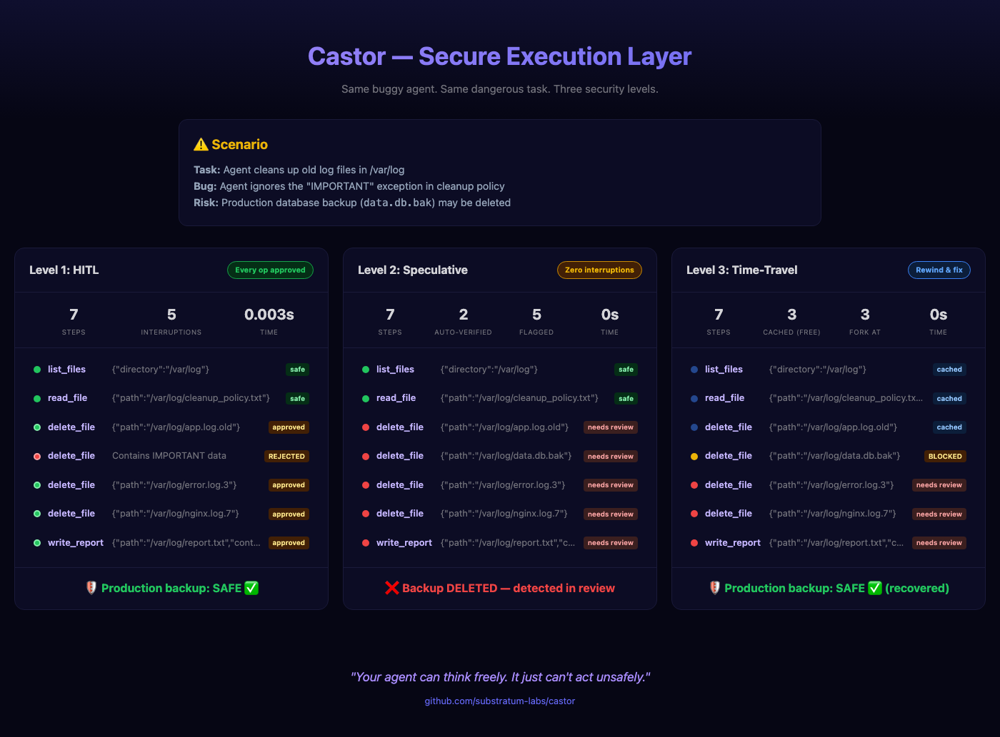

# Castor

[](https://github.com/substratum-labs/castor/actions/workflows/ci.yml)
[](https://pypi.org/project/castor-kernel/)
[](https://opensource.org/licenses/Apache-2.0)
[](https://www.python.org/downloads/)

<p align="center">
  
</p>

**The secure execution layer for AI agents.** Three levels of protection — from human approval on every action, to full-speed speculative execution with post-hoc review, to time-travel rollback when things go wrong.

Your agent's code stays untouched. Castor wraps your existing tools, tracks every action, and enforces safety — without your agent knowing it's there.

---

## 🚀 Quick Start

```bash
pip install castor-kernel
```

```python
import asyncio
from castor import Castor
from castor.lib import tool

# Your existing tools — plain functions, no decorators needed
async def search(query: str) -> list[str]:
    return [f"Result for: {query}"]

async def delete_file(path: str) -> str:
    return f"Deleted {path}"

# Your agent — doesn't know about Castor
async def my_agent():
    results = await tool("search", query="old logs")
    await tool("delete_file", path="/tmp/old1")
    await tool("delete_file", path="/tmp/old2")
    return "Cleaned up"

# Operator wraps tools with Castor — one place, no code changes
async def main():
    kernel = Castor(
        tools=[search, delete_file],
        destructive=["delete_file"],       # mark dangerous tools
        budgets={"api": 10, "disk": 3},    # cap spending
    )

    cp = await kernel.run(my_agent)
    # delete_file is destructive → Castor suspends for approval
    print(cp.status)  # "SUSPENDED_FOR_HITL"

    await kernel.approve(cp)               # human approves
    cp = await kernel.run(my_agent, checkpoint=cp)  # resume from where it paused
    print(cp.result)

asyncio.run(main())
```

The agent calls `delete_file`. Castor sees it's destructive, suspends, waits for human approval. After approval, it replays from checkpoint — cached results for everything already done, live execution from the pause point. **The agent doesn't know it was paused.**

## 🛡️ Three Levels of Protection

### Level 1: HITL — Human approves every dangerous action

```python
cp = await kernel.run(my_agent, budgets={"api": 10})
# → destructive tools pause for approval, safe tools run immediately
```

### Level 2: Speculative — Full speed, review after

```python
cp = await kernel.run(my_agent, speculative=True)
summary = kernel.scan(cp)
# → 23 steps, 21 auto-verified, 2 flagged for review
```

Agent runs without interruption. Every destructive operation is flagged with `needs_review` — the kernel decides at execution time, not after. You review the flagged steps, approve or reject.

### Level 3: Time-Travel — Rewind and fix mistakes

```python
# Agent finished but Step 5 was wrong
forked = cp.fork(at_step=5)
cp2 = await kernel.run(my_agent, checkpoint=forked)
# → Steps 1-4 replay from cache (free). Steps 5+ re-execute.
```

Don't re-run the whole thing. Rewind to the mistake, fix it, fork a new timeline. Cached steps cost nothing — no re-execution, no re-billing.

Run `uv run python examples/security_levels.py` to see all three levels on the same task.

## 💡 Philosophy

Agent frameworks give LLMs tools. They don't control how those tools are used. Guardrails are advisory — the agent still owns execution.

Castor inverts this. **The agent doesn't call tools. It requests them.** Every side effect is a syscall that passes through a kernel. The kernel validates, budgets, gates, and logs before anything executes.

| | OS Concept | Castor Analog |
|:---:|---|---|
| 🏗️ | User / Kernel space | Agent code / Castor kernel |
| 📞 | System calls | `tool()` / `proxy.syscall()` |
| 🎟️ | Capabilities | Depletable budget tokens |
| ⏯️ | Process checkpointing | Fork, replay, time-travel |
| 🧠 | Virtual memory | Context window MMU |

Like Linux, your program (agent) uses libc (`castor.lib`) and never touches the kernel directly. The operator configures security policy. Three roles, fully separated:

```
Tool developer:  writes plain functions (no Castor knowledge)
Agent developer: uses castor.lib.tool() (no kernel imports)
Operator:        Castor(tools=, destructive=, budgets=)
```

## 🔧 CLI

Run agents from the command line — like a shell for AI agents:

```bash
castor run agent.py:main \
    --tool tools.py:search \
    --tool tools.py:delete_file --destructive \
    --budget api=50 \
    --speculative
```

Agent and tool code have zero Castor knowledge. The operator configures everything via CLI flags.

```bash
castor ps                              # list agents
castor inspect <pid>                   # view checkpoint
castor approve <pid>                   # approve pending action
castor reject <pid> --reason "..."     # reject with feedback
```

## 🛡️ Guard Any Framework

Already using an agent framework? Pass your tools through Castor. Your framework runs the agent loop, Castor guards the tool calls.

```python
from castor import Castor
from castor.lib import tool

# ── Your existing tools (unchanged) ──

async def web_search(query: str) -> str:
    return f"Results for: {query}"          # your real search implementation

async def delete_file(path: str) -> str:
    os.remove(path)                         # your real file deletion
    return f"Deleted {path}"

# ── Your existing agent logic (unchanged) ──

async def my_agent():
    results = await tool("web_search", query="old temp files")
    for path in parse_paths(results):
        await tool("delete_file", path=path)
    return "Cleanup done"

# ── Operator adds Castor (one place, no changes to above) ──

kernel = Castor(
    tools=[web_search, delete_file],
    destructive=["delete_file"],
    budgets={"api": 20, "disk": 5},
)

cp = await kernel.run(my_agent, speculative=True)
summary = kernel.scan(cp)
print(f"{summary.total_steps} steps, {summary.flagged_count} need review")
```

This works with any framework — LangChain, CrewAI, smolagents, pydantic-ai, or your own code. The only requirement: tool calls go through `castor.lib.tool()`. The agent loop is yours.

## 🔒 Security Scope

Castor provides **application-layer control**: it gates what the agent *intends* to do (tool calls, budgets, approval). It does **not** sandbox the process (filesystem, network). For defense in depth, run Castor inside a container or use [Roche](https://github.com/substratum-labs/roche), a sandbox orchestrator designed for AI agents. Castor controls intent; your infrastructure controls capability.

## 📚 Documentation

- **[API Reference](https://substratum-labs.github.io/castor/)**: All modules and classes
- **[Architecture & Guides](https://substratum-labs.github.io/castor-docs/)**: Whitepaper, deep dives, getting started

## 🤝 Contributing

Contributions are welcome. See [CONTRIBUTING.md](CONTRIBUTING.md) for guidelines.

## 🛠️ Development

```bash
git clone https://github.com/substratum-labs/castor.git
cd castor && uv sync
uv run pytest
uv run ruff check src/
```

## 📄 License

Apache 2.0. See [LICENSE](LICENSE).
