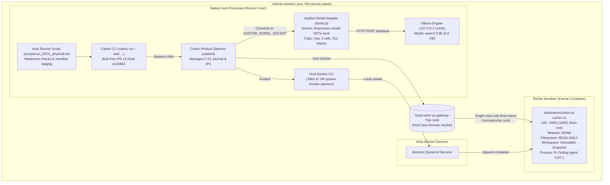

# T-337-E: Physical Pi One-Shot Execution Plan & Reviewable Staging

## 1. Executive Summary & Material Corrections

This document defines the reviewable staging and execution plan for **T-337-E** ([EPIC-39 / Phase 4] Physical Pi Task, Review, and Product Decision).

This revision corrects two material errors from the preliminary plan:
1. **Workflow Trigger Mechanism**: GitHub documentation specifies that `workflow_dispatch` workflows only execute if the workflow definition already exists on the default repository branch (`main`). Because this work is staged on a feature PR branch, `workflow_dispatch` cannot be used. We replace it with a dedicated `pull_request` labeled-trigger workflow (`.github/workflows/t337e-physical-gate.yml`) strictly gated by an explicit one-use label (`run-t337e-physical`) and exact head/base branch assertions. No push, PR open, PR synchronize, or ordinary label event can invoke live inference.
2. **Runner Disk Sizing & Headroom Strategy**: A runner with ~14 GB available root disk cannot become 45 GB free from simple toolchain cleanup. We do not claim more disk than the runner actually provides. The runner executes safe package cleanup, inspects `df -k /`, and strictly fails before model pull if available headroom is less than 11 GB (sufficient for the 6.6 GB `qwen3.5:9b` model, release binaries, and carrier image).
3. **Certified Failure Matrix**: In the prior plan, an interaction budget exhaustion following an armed edit was erroneously described as ordinary `FAILED(MODEL_INTERACTION_ERROR)`. Castor's supervisor architecture dictates that any armed action lacking a trusted settlement receipt (e.g. C-05 `NotApplied` / `VerifiableNonExecution` or `Applied` / `Confirmed`) must be classified as **`UNKNOWN_DISPUTED`** (`ARMED_UNSETTLED_EFFECT`), retaining all workspace and journal evidence for forensic review.

---

## 2. Certified Failure Matrix

| Scenario / Failure Mode | Detection Mechanism | Castor / Adapter Handling | Certified Task Outcome | Evidence Retained |
| :--- | :--- | :--- | :--- | :--- |
| **Clean Patch & Test Pass** | Actuator + Verification Command | Actuator validates with `git apply --check`, applies patch, commits turn, and signs HMAC receipt. All 7 duration tests pass. | **`SUCCEEDED`** `settled_actions_count: 1` `committed_turns: [1]` | Applied patch diff, passing test log, journal. |
| **Invalid Patch Rejected by Actuator** | Actuator `validate_patch` (`git apply --check`) | Actuator certifies `NotApplied` / `VerifiableNonExecution` with HMAC-signed receipt. | **`FAILED(PATCH_VALIDATION_FAILED)`** `settled_actions_count: 1` `committed_turns: [1]` | Attempted diff, rejected receipt, journal. |
| **Armed Unsettled Action followed by 4th Interaction / Severed Socket** | Adapter cap / Supervisor Journal check | Adapter returns framed `INTERACTION_BUDGET_EXHAUSTED` or socket closes. Supervisor checks `armed_without_settlement(&journal)`: action is armed without trusted settlement. | **`UNKNOWN_DISPUTED`** `failure_reason: "ARMED_UNSETTLED_EFFECT"` *(Never ordinary FAILED)* | Workspace dispute snapshot, full journal, adapter logs, raw result. |
| **4th Interaction Requested Before Any Action Armed** | Adapter cap (`uniqueIds.size >= 3`) | Adapter returns framed `INTERACTION_BUDGET_EXHAUSTED`. Supervisor terminates Roche. Journal contains 0 armed actions. | **`FAILED(MODEL_INTERACTION_ERROR)`** `settled_actions_count: 0` `committed_turns: []` | Adapter events log, raw result, container stderr. |
| **Hunk Syntax / Line Count Defect** | Pi Extension `checkPatchShape` | Cooperative client-side validation rejects malformed hunk before arming; model receives error in tool result. | Turn 3 repair opportunity; if unhandled: **`FAILED(UNSETTLED_ACTIONS)`** | Tool result log, Pi transcript. |
| **Supervisor Timeout (>300s) Before Arming** | Supervisor watchdog | Host terminates Roche container and revokes fences. 0 armed actions. | **`FAILED(TIMEOUT_EXCEEDED)`** `settled_actions_count: 0` | Process exit code, timeout log. |

---

## 3. Architecture: Safe Native Linux Host Execution Topology

Execution takes place directly on the GitHub-hosted Linux VM (`ubuntu-latest`) as native host processes. No Docker-in-Docker or `/var/run/docker.sock` bind mount is used.

### Security Invariants
1. **Zero Docker Socket Exposure**: The VM Docker socket `/var/run/docker.sock` is accessed exclusively by the host `docker` CLI from host processes. No container receives `/var/run/docker.sock`.
2. **Unprivileged Guest Sandbox**: The Pi carrier container runs with:
   - `--network none`
   - `--read-only`
   - `--user 10001:10001`
   - `--cap-drop ALL`
   - `--security-opt no-new-privileges`
   - Exactly one bind mount: host IPC socket mounted read-only to `/run/castor/ipc.sock`.
3. **Loopback-Pinned Model Adapter**: Audited adapter connects strictly to `http://127.0.0.1:11434/api/chat` with `redirect: "error"`, refusing network egress or non-loopback endpoints.

---

## 4. Fixture and Post-Fix Carrier Alignment

### Duration Task Fixture
- Pinned tarball: `fixtures/t337e_duration/workspace_snapshot.tar.gz` (976 bytes).
- Verified SHA-256: `d64c1fb8f73530b81e43d621f2c9afad9ef2cc5c188c06ec5b0db7c389c4f99f`.
- Target: Fix calculation for days (`'d'`) in `duration.py` so `python3 -m unittest tests/test_duration.py` passes all 7 tests.

### Post-Fix Carrier Alignment
1. Carrier image `substratum/castor-pi-carrier:v1` is built dynamically on the runner from `kernel/carrier/pi`.
2. Exact carrier image ID (`sha256:...`) is inspected via `docker image inspect`.
3. Staged manifest `task_manifest.json` is generated with `carrier_base_image: "substratum/castor-pi-carrier:v1@${CARRIER_IMAGE_ID}"` and fresh idempotency key `t337e-local-model-run-002`.

---

## 5. Reviewable Staging Inventory

| Component | Path | Purpose |
| :--- | :--- | :--- |
| **Workflow** | `.github/workflows/t337e-physical-gate.yml` | Gated `pull_request: [labeled]` workflow requiring label `run-t337e-physical`. Consumes label on start, checks disk headroom, runs host script, and uploads evidence on every outcome. |
| **Runner Script** | `scripts/run_t337e_physical.sh` | Native Linux host orchestration: environment diagnostics, disk headroom check, binary build, carrier image build, manifest staging, Ollama & adapter lifecycle, bounded task run, evidence capture. |
| **Task Fixture** | `fixtures/t337e_duration/` | Pinned single-defect duration snapshot (`workspace_snapshot.tar.gz`), checksum verification file, and manifest template. |
| **Audited Adapter** | `kernel/carrier/pi/host/ollama_model_adapter.mjs` | Bounded model adapter enforcing max 3 unique interactions, 512 max_tokens, 4-byte BE framing, and canonical request digests. |
| **Offline Tests** | `kernel/carrier/pi/host/test_adapter.mjs` | 100% mocked offline adapter test suite verifying all invariants without network. |
