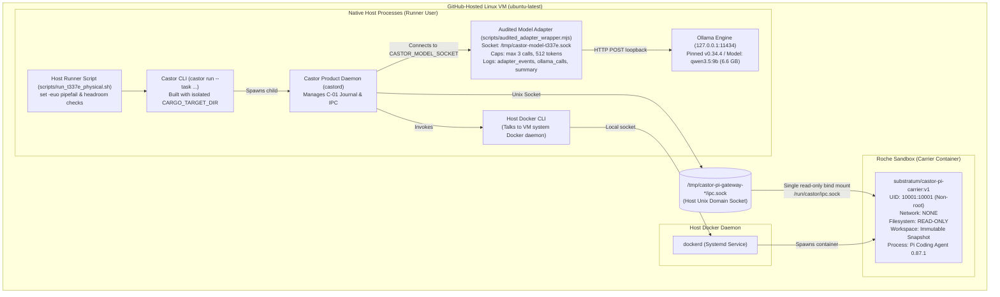

# T-337-E: Physical Pi One-Shot Execution Plan & Reviewable Staging

## 1. Executive Summary & Review Revisions

This document defines the reviewable staging and execution plan for **T-337-E** ([EPIC-39 / Phase 4] Physical Pi Task, Review, and Product Decision).

This document incorporates all blocking review findings:
1. **Workflow Trigger & Label Management**: A dedicated `pull_request` labeled-trigger workflow (`.github/workflows/t337e-physical-gate.yml`) is strictly gated by an explicit one-use label (`run-t337e-physical`) and exact head/base branch assertions. The workflow strictly consumes and verifies label removal via `gh pr edit` before any model pull or execution (without ignoring errors via `|| true`), guaranteeing single-use semantics. In environments where automated PR mutation is disallowed, `pull-requests: write` may be omitted and manual maintainer label management applied truthfully.
2. **Pinned Ollama Asset Verification**: Replaced unverified remote installer scripts (`curl | sh`) with pinned official Ollama v0.34.4 Linux amd64 `tar.zst` release assets from GitHub Releases verified against SHA-256 `c238986e61d40c0cc5f4a9b9e40b9eea104350b77efa34741fc134e105cb9533`. Ollama binary version and model ID/digest are permanently recorded in environment evidence.
3. **Audited Host Adapter & Complete Evidence Bundle**: Integrated an audited wrapper (`scripts/audited_adapter_wrapper.mjs`) around the versioned host model adapter to log `adapter_events.jsonl`, count and log each unique Ollama HTTP call in `ollama_calls.jsonl`, enforce bounded `num_predict <= 512`, record stop reasons/usage/latencies, and generate `adapter_summary.json` without logging secrets.
4. **Independent Post-Run Host Verification**: Post-run verification extracts the baseline fixture to an isolated directory and executes all 7 tests. If `TaskResult` supplies `patch_diff`, the exact patch is saved to `attempted_patch.diff`, verified with `git apply`, and retested, recording all exit codes and SHA digests in `host_verification.txt`. Entire task-state journal, regions, and Pi container logs are preserved. No absent evidence is falsely claimed.
5. **Clean Working Tree & Isolated Build Artifacts**: Reverted unsolicited `.gitignore` additions; builds use `CARGO_TARGET_DIR` under temp to prevent repository pollution.

---

## 2. Certified Failure Matrix

| Scenario / Failure Mode | Detection Mechanism | Castor / Adapter Handling | Certified Task Outcome | Evidence Retained |
| :--- | :--- | :--- | :--- | :--- |
| **Clean Patch & Test Pass** | Actuator + Verification Command | Actuator validates with `git apply --check`, applies patch, commits turn, and signs HMAC receipt. All 7 duration tests pass. | **`SUCCEEDED`** `failure_reason: "NONE"` `settled_actions_count: 1` `committed_turns: [1]` `test_passed: true` `test_exit_code: 0` | `task_result.json`, `attempted_patch.diff`, passing test log in `host_verification.txt`, state journal, `pi.jsonl`. |
| **Patch Applied but Tests Fail** | Actuator + Verification Command | Actuator applies patch with signed HMAC receipt, but test command exits non-zero. | **`FAILED`** `failure_reason: "TEST_VERIFICATION_FAILED"` `settled_actions_count: 1` `committed_turns: [1]` `test_passed: false` `test_exit_code: <non-zero>` | `task_result.json`, `attempted_patch.diff`, failing test output in `host_verification.txt`, state journal. |
| **Invalid Patch Rejected by Actuator** | Actuator `validate_patch` (`git apply --check`) | Actuator certifies `NotApplied` / `VerifiableNonExecution` with HMAC-signed receipt. No workspace mutation. | **`FAILED`** `failure_reason: "PATCH_VALIDATION_FAILED"` `settled_actions_count: 1` `committed_turns: [1]` `test_passed: null` `patch_diff: null` | `task_result.json`, rejected settlement receipt in `state/`, `host_verification.txt` (records baseline test run and notes absence of patch_diff). |
| **Armed Unsettled Action followed by 4th Interaction / Severed Socket** | Adapter cap / Supervisor Journal check | Adapter returns framed `INTERACTION_BUDGET_EXHAUSTED` or socket closes. Supervisor checks `armed_without_settlement(&journal)`: action is armed without trusted settlement. | **`UNKNOWN_DISPUTED`** `failure_reason: "ARMED_UNSETTLED_EFFECT"` *(Never ordinary FAILED)* | Workspace dispute snapshot in `quarantine/`, full journal, `adapter_events.jsonl`, `ollama_calls.jsonl`, `adapter_summary.json`. |
| **4th Interaction Requested Before Any Action Armed** | Adapter cap (`uniqueIds.size >= 3`) | Adapter returns framed `INTERACTION_BUDGET_EXHAUSTED`. Supervisor terminates Roche. Journal contains 0 armed actions. | **`FAILED`** `failure_reason: "MODEL_INTERACTION_ERROR"` `settled_actions_count: 0` `committed_turns: []` | `adapter_events.jsonl` (framed error recorded), `ollama_calls.jsonl`, `adapter_summary.json`, `castor_stderr.log`. |
| **Hunk Syntax / Line Count Defect** | Pi Extension `checkPatchShape` | Cooperative client-side validation rejects malformed hunk before arming; model receives error in tool result. If uncorrected before session exit: | **`FAILED`** `failure_reason: "UNSETTLED_ACTIONS"` `settled_actions_count: 0` `committed_turns: []` | `pi.jsonl` (Pi container log), adapter logs, state journal. |
| **Supervisor Timeout (>300s) Before Arming** | Supervisor watchdog | Host terminates Roche container and revokes fences. 0 armed actions. | **`FAILED`** `failure_reason: "TIMEOUT_EXCEEDED"` `settled_actions_count: 0` `committed_turns: []` | Process exit code in `castor_exit_code.txt`, `castor_stderr.log`. |

---

## 3. Architecture: Safe Native Linux Host Execution Topology

Execution takes place directly on the GitHub-hosted Linux VM (`ubuntu-latest`) as native host processes. No Docker-in-Docker or `/var/run/docker.sock` bind mount is used.

### Security Invariants
1. **Zero Docker Socket Exposure**: The VM Docker socket `/var/run/docker.sock` is accessed exclusively by the host `docker` CLI from host processes. No container receives `/var/run/docker.sock`.
2. **Unprivileged Guest Sandbox**: The Pi carrier container runs with:
   - `--network none`
   - `--read-only`
   - `--user 10001:10001`
   - `--cap-drop ALL`
   - `--security-opt no-new-privileges`
   - Exactly one bind mount: host IPC socket mounted read-only to `/run/castor/ipc.sock`.
3. **Loopback-Pinned Model Adapter**: Audited adapter connects strictly to `http://127.0.0.1:11434/api/chat` with `redirect: "error"`, refusing network egress or non-loopback endpoints.
4. **No Remote Shell Scripts**: All installers are pinned binary release assets verified by SHA-256 checksums prior to extraction.

---

## 4. Fixture and Post-Fix Carrier Alignment

### Duration Task Fixture
- Pinned tarball: `fixtures/t337e_duration/workspace_snapshot.tar.gz` (976 bytes).
- Verified SHA-256: `d64c1fb8f73530b81e43d621f2c9afad9ef2cc5c188c06ec5b0db7c389c4f99f`.
- Target: Fix calculation for days (`'d'`) in `duration.py` so `python3 -m unittest tests/test_duration.py` passes all 7 tests.

### Post-Fix Carrier Alignment
1. Carrier image `substratum/castor-pi-carrier:v1` is built dynamically on the runner from `kernel/carrier/pi`.
2. Exact carrier image ID (`sha256:...`) is inspected via `docker image inspect`.
3. Staged manifest `task_manifest.json` is generated with `carrier_base_image: "substratum/castor-pi-carrier:v1@${CARRIER_IMAGE_ID}"` and fresh idempotency key `t337e-local-model-run-002`.

---

## 5. Reviewable Staging Inventory & Evidence Artifacts

| Component / Artifact | Path | Purpose |
| :--- | :--- | :--- |
| **Workflow** | `.github/workflows/t337e-physical-gate.yml` | Gated `pull_request: [labeled]` workflow requiring label `run-t337e-physical`. Strictly consumes label before model pull, enforces headroom, installs pinned Ollama v0.34.4, runs host script, and uploads evidence bundle on every outcome. |
| **Runner Script** | `scripts/run_t337e_physical.sh` | Native Linux host orchestration under `set -euo pipefail`: disk check, binary build under temp target dir, carrier build, manifest staging, Ollama & audited adapter lifecycle, bounded task run, and independent host verification. |
| **Audited Adapter Wrapper** | `scripts/audited_adapter_wrapper.mjs` | Wrapper around versioned host adapter producing `adapter_events.jsonl`, `ollama_calls.jsonl`, and `adapter_summary.json` without logging secrets. |
| **Adapter Test Suite** | `scripts/test_audited_adapter.mjs` | 100% mocked offline test suite verifying wrapper event logging, HTTP call logs, bounded num_predict, framed error recording, and zero secret leakage. |
| **Preflight Abort Tests** | `scripts/test_preflight_aborts.sh` | Offline test suite asserting preflight fail-fast aborts (OS check, disk space, fixture SHA mismatch) and safety invariants. |
| **Task Fixture** | `fixtures/t337e_duration/` | Pinned single-defect duration snapshot (`workspace_snapshot.tar.gz`), checksum verification file, and manifest template. |
| **Evidence: Events Log** | `evidence/adapter_events.jsonl` | Line-by-line structured JSON log of adapter events, token bounds, and wire errors. |
| **Evidence: HTTP Calls** | `evidence/ollama_calls.jsonl` | Line-by-line structured JSON log of each unique Ollama HTTP call with token usage, stop reason, and latency. |
| **Evidence: Adapter Summary** | `evidence/adapter_summary.json` | High-level summary of total envelopes, unique interactions, calls, cache hits, and errors. |
| **Evidence: Attempted Patch** | `evidence/attempted_patch.diff` | Exact unified diff extracted from `TaskResult` when supplied (omitted if no patch was produced). |
| **Evidence: Host Verification** | `evidence/host_verification.txt` | Independent verification report running 7 baseline tests, applying patch via `git apply`, retesting, and recording SHA256 and exit codes. |
| **Evidence: State & Logs** | `evidence/state/`, `evidence/pi.jsonl` | Preserved task-state journal, regions, dispute snapshots, and Pi container logs. |
